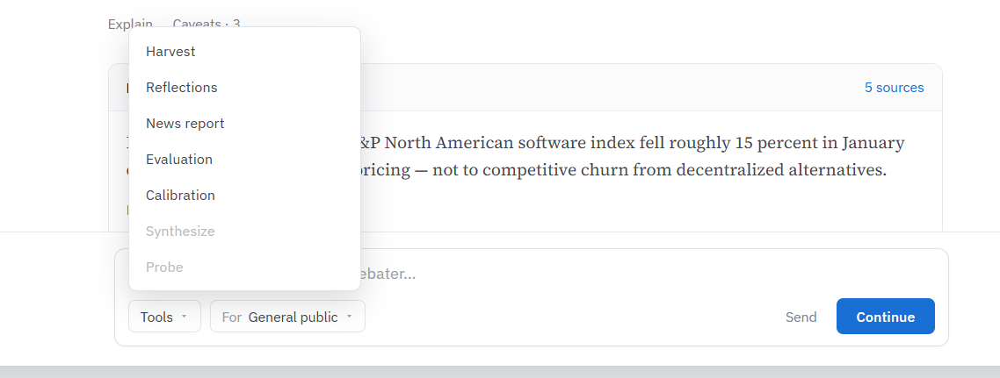

# Debate Action Bar Redesign — Tools menu + clean composer

**Last updated:** 2026-08-08
**Author:** Design (Orca)
**Status:** Proposal — for approval (t/2279)
**Requested by:** Tech Lead (t/2279)
**Mockup:** `docs/ux/assets/debate-action-bar-t2279.png` (owner mock, from `c:\tmp\t8.png`)
**Implements:** redesign of the debate window bottom bar (`DebateActionBar.tsx` + `DebateActionBar.css`, DebateWorkspace scope)

## 1. Problem

The debate window bottom bar (`DebateActionBar` → `DebateActions`) renders three stacked rows:
1. `DebateInputBar` — input (`Ask a question (@Safetyist to target)…`) + `Send` (primary).
2. `CrossRespondControls` — `Continue`/`Step` + `Auto/Step` toggle (adaptive), or `Cross-Respond` + a turns `<select>` (non-adaptive).
3. `SecondaryActionBar` — a **flat strip of ~7 buttons** (Synthesize · Probe · Harvest · Reflections · News Report · Evaluation · Calibration) + a flight-recorder `↓` dump + the audience `<select>`.

The secondary strip is visually noisy and reads as an undifferentiated button row.

## 2. Target (mockup)

A single composer card:
- Full-width text input ("Ask the debater…").
- **Bottom-left:** `Tools ▾` menu (collapses the secondary actions) + `For [audience ▾]` selector.
- **Bottom-right:** `Send` (secondary text button) + `Continue` (primary accent button).



## 3. Tools menu — contents, order, gating

All secondary actions move into `Tools ▾`. **Order per mockup; each item preserves its existing handler, enabled/disabled rule, and tooltip** (no behavior change — relocation + grouping only):

| # | Item | Handler | Enabled when | Tooltip (unchanged) |
|---|---|---|---|---|
| 1 | Harvest * | `setShowHarvest(true)` | `!disableAnalysis && hasSynthesis` | "Harvest debate findings into the taxonomy" |
| 2 | Reflections | `setShowReflections(true)` + `requestReflections()` | `!disableAnalysis` | "Each debater reflects on the debate and proposes taxonomy edits" |
| 3 | News report | `setShowNewsReport(true)` | `!disableAnalysis && hasSynthesis` | hasSynthesis ? "Generate a news-style article from this debate" : "Synthesis required before generating news report" |
| 4 | Evaluation *(toggle)* | `setShowEvaluation(!showEvaluation)` | `hasEvaluations` | "Show/hide independent evaluation of claims and cruxes" |
| 5 | Calibration * *(toggle)* | `setShowParamHistory(!showParamHistory)` | always (admin) | "View calibration parameter history and current values" |
| — | *divider* | | | |
| 6 | Synthesize | `requestSynthesis()` | `!disableAnalysis && !hasSynthesis` | hasSynthesis ? "Synthesis already generated" : "Generate a synthesis of agreements, disagreements, and open questions" |
| 7 | Probe | `requestProbingQuestions()` | `!disableAnalysis && !isClosed` | "Get AI-suggested probing questions to deepen the debate" |
| — | *divider* | | | |
| 8 | Export flight recorder * | `triggerManualDump` | always (admin/electron) | "Export flight recorder (Ctrl+Alt+D)" |

`hasSynthesis` = transcript has a `concluding` entry; `hasEvaluations` = `activeDebate.neutral_evaluations?.length`; `disableAnalysis` = generating or sending.

\* **Admin/electron-only** (`showAdminControls = isElectronMode() || flag('permission-admin-features')`): **Harvest, Calibration, Export flight recorder** are hidden when `!showAdminControls`. Non-admin menu = Reflections · News report · Evaluation · Synthesize · Probe.

- **Disabled items stay visible**, greyed (`--text-muted`, `cursor: not-allowed`, `aria-disabled="true"`), and are skipped by arrow-key nav — matches the mockup's greyed Synthesize/Probe (that debate already has a synthesis, so Synthesize greys; Probe greys when closed).
- **Toggles** (Evaluation, Calibration) show a checked state (leading ✓ or persistent highlight) when active (`showEvaluation` / `showParamHistory`).
- The three groups (outputs · generation · utility) are separated by dividers.

**Open question resolved (flight recorder):** relocated INTO Tools (utility group, admin/electron). The `Ctrl+Alt+D` shortcut is unchanged, so power users lose nothing and the composer stays clean.

## 4. Audience selector — `For [audience ▾]`

A static `For` label (`--text-secondary`) + the existing audience `<select>` (`audience` / `setAudience`, `DEBATE_AUDIENCES`), styled like the t/2278 value dropdown (native `<select>`: `--bg-primary` bg, `1px --border-color`, `--text-primary`). Sits immediately right of `Tools ▾`. Give the `<select>` an `aria-label="Audience"` (the visible "For" prefix is not a `<label>`).

## 5. Send + Continue (bottom-right)

- **Send** — secondary/text button (was `btn-primary`). Transparent bg; `--text-secondary` → `--text-primary` on hover; disabled `--text-muted`. Action = existing `handleSend` (`askQuestion`). Disabled when `!input.trim() || disableAnalysis`. Enter-in-input still sends (unchanged).
- **Continue** — the PRIMARY action button (accent fill + `#fff`). This is the existing cross-respond/step primary (`handleCrossRespond`). Label is state-dependent (existing behavior): adaptive-auto → **Continue**; adaptive-step → **Step**; non-adaptive → **Cross-Respond**. Disabled when `disableAnalysis`. Rendered only when `!isSocratic` (unchanged — a solo/Socratic debate has no cross-respond).

### 5.1 Where the mode/turns controls go (open question resolved)

The mockup shows only "Continue," but the **Auto/Step toggle** (adaptive) and **Cross-Respond turns** selector (non-adaptive) still need a home. **Recommendation: make Continue a split button** — the primary action + a trailing caret (▾) opening a small menu:
- Adaptive → an **Auto / Step** choice (`toggleStepMode`, reflects `isStepMode`).
- Non-adaptive → the **turns** count (1/2/3/6/9/12/15/18/21 → `setCrossRespondTurns`).

This keeps the composer minimal while giving the controls a discoverable home. **Alternative (lower-effort):** a small inline control immediately left of Continue — an `Auto | Step` segmented toggle (adaptive) or a turns `<select>` (non-adaptive). Either is acceptable; the split-button is cleaner and matches the single-button mockup.

### 5.2 Step-phase selector

`StepPhaseSelector` ("Stage:" pills → `setDebatePhase`) appears only in step mode (an advanced flow). Keep it as a thin row **above** the composer card when `isStepMode`, unchanged — it is not part of the composer.

## 6. Layout & what stays

Composer card (rounded; `--bg-primary`, `1px --border-color`, `--radius`, subtle `--shadow-1`):

```
┌──────────────────────────────────────────────────────────────┐
│  Ask the debater...                                           │  ← input, full width
│                                                              │
│  [ Tools ▾ ]  For [ General public ▾ ]        Send  [Continue]│  ← controls row
└──────────────────────────────────────────────────────────────┘
```

Unchanged and **outside** the composer (render above/below as today): `DebateErrorBanner`, `TokenBudgetIndicator`, the "…is responding…" hint, and the input's @mention dropdown.

## 7. Visual tokens (AA, all four themes — no hard-coded hex)

| Element | Tokens |
|---|---|
| Composer card | bg `--bg-primary`, border `--border-color`, radius `--radius`, shadow `--shadow-1` |
| Input text / placeholder | `--text-primary` / `--text-muted` |
| `Tools ▾` button, audience `<select>` | bg `--bg-primary`, `1px --border-color`, text `--text-primary`; hover `--bg-hover` |
| "For" label | `--text-secondary` |
| Menu popover | bg `--bg-primary`, `1px --border-color`, `--shadow-1`; item `--text-primary`, hover `--bg-hover`; disabled `--text-muted`; divider `--border-color` |
| `Send` | transparent bg, `--text-secondary` → `--text-primary` hover; disabled `--text-muted` |
| `Continue` (primary) | accent fill `var(--focus-ring)` + `#fff` (verify AA per theme: light #3b82f6, dark #60a5fa, bkc #4d7a8b, harvard #A51C30 — all clear AA vs white) |

Reuse the t/2278 native-`<select>` styling for the audience selector.

## 8. Accessibility

- **Tools menu** — these are *actions*, not values, so use a custom menu (NOT a native `<select>`): trigger `aria-haspopup="menu"` + `aria-expanded`; popover `role="menu"`, items `role="menuitem"`. Open on click / Enter / Space / ArrowDown; ArrowUp/Down move between **enabled** items (disabled items `aria-disabled="true"`, skipped); Enter/Space activate; **Esc closes and returns focus to the Tools button**; click-outside closes. Toggle items expose checked state (`aria-checked` on a `menuitemcheckbox`).
- **Continue split-button** (if adopted, §5.1): the caret is a separate `aria-haspopup` control with the same menu semantics (Esc-close, focus-return, arrow nav).
- **Audience `<select>`** — native, keyboard-accessible for free; needs `aria-label="Audience"`.
- **Send / Continue** — standard buttons; disabled via `disabled`. After Send, focus returns to the input (unchanged).

## 9. Acceptance

1. Composer matches the mockup: full-width input; bottom-left `Tools ▾` + `For [audience ▾]`; bottom-right `Send` (secondary) + `Continue` (primary accent).
2. Tools menu contains all secondary actions in the specified order, each preserving its existing handler, enabled/disabled rule, and tooltip; admin-only items (Harvest, Calibration, flight-recorder) hidden when `!showAdminControls`; Evaluation/Calibration show a checked state.
3. Auto/Step toggle + Cross-Respond turns have a defined home (Continue split-button caret, or inline control); the step-phase selector still appears in step mode.
4. Flight-recorder dump relocated into Tools (admin/electron); `Ctrl+Alt+D` unchanged.
5. Tokens only; AA in light/dark/bkc/harvard; consistent with `.debate-redesign`.
6. Tools-menu keyboard: open / navigate / activate, **Esc closes + focus returns**, disabled items skipped; audience `<select>` has `aria-label`.

## 10. Open questions for the owner / TL

- **Q1 — mode/turns home (§5.1):** recommend the Continue **split-button** (caret ▾). Confirm vs a small inline control.
- **Q2 — menu order:** the mockup groups outputs (Harvest/Reflections/News/Evaluation/Calibration) first, generation (Synthesize/Probe) last. Confirm — Synthesize/Probe are prerequisites, but by the time you're deriving outputs they're usually already run, so bottom placement reads fine.
- **Q3 — `Continue` primary color:** the mockup's blue = the `--focus-ring` accent. The design system currently lists `.btn-primary` as `var(--success)` (green). Confirm Continue should use the accent (`--focus-ring`), and whether to reconcile the app's primary-button token to match.

## 11. What NOT to do

- Do **not** change any action's behavior or gating — this is relocation + grouping only. Every handler, disabled-condition, and tooltip is carried over verbatim.
- Do **not** use a native `<select>` for the Tools menu — its items are actions with per-item disabled state, toggles, and dividers. Use a custom `role="menu"`.
- Do **not** hard-code the primary/accent color — use `var(--focus-ring)`; resolve Q3 before landing.
- Do **not** drop the `Ctrl+Alt+D` flight-recorder shortcut when moving the button into Tools.
