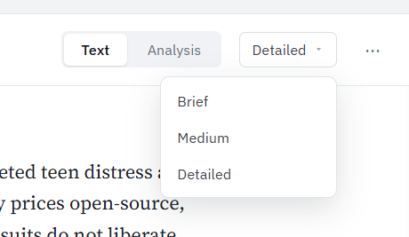

# Debate View-Mode Controls — Two-Mode Redesign

**Last updated:** 2026-08-05
**Author:** Design (Orca)
**Status:** Shipped (t/2172, PR #471) — Design signed off on all 10 ACs (t/2172#3); §6/§7 override-marker color corrected to `#fff` post-review
**Requested by:** Jeffrey (p/351)
**Implements:** redesign of the debate statement / global view-mode button row into a two-mode model

---

## 1. Problem

Every debate statement, and the debate window's top toolbar, currently render **one flat run of buttons** that mixes two conceptually different things:

- **Text length** — how verbose the prose rendering of the turn is (Brief / Med / Detail).
- **Metadata views** — structured, non-prose views that *replace* the text (Plan / Terms / Lineage / Claims / Conv).

Today they sit side-by-side as peers in a single strip:

```
Per statement:   BRIEF  MED  DETAIL  PLAN  [TERMS]  [LINEAGE]  CLAIMS  CONV
Global (toolbar):  BRIEF  MED  DETAIL  PLAN  CLAIMS  CONV
```

There is no visual signal that "Detail" and "Plan" answer different questions. A user reading at *Detail* who clicks *Plan* loses their text-length choice with no way to see they've left "text" at all. The strip also grows unbounded as more metadata views are added.

Source of truth today:
- Per-statement strip: `StatementTierPills` in `StatementCard.tsx` (tiers `brief|medium|detailed` then `reasoning|terms|lineage|claims|convergence`).
- Global strip: `.debate-tier-global` in `DebateToolbar` (`DebateWorkspace.tsx`), tiers `brief|medium|detailed|reasoning|claims|convergence`.
- Both drive a **single** enum: per-statement `entry.display_tier`, global `responseLength` (the per-statement default). `META_TIERS` already classifies which tiers are "metadata".

## 2. Goal (Jeffrey's conceptual model)

Reorganize into **two modes**, each with its own sub-options, at **both** levels (per-statement and the global toolbar):

| Mode | Sub-options | Meaning |
|---|---|---|
| **Text** | Brief · Medium · Detailed | verbosity of the prose rendering |
| **Analysis** | Plan · Terms · Claims · Conv | structured views that replace the prose |

The user first picks a **mode**, then picks a **sub-option** within it. Selecting a mode restores the sub-option they last used in that mode, so switching modes is lossless.

> **Mode name — decided.** Jeffrey floated "Other (metadata?)"; confirmed as **"Analysis"** (p/351#6). All four non-text views (Plan = reasoning/BDI, Terms = vocabulary, Claims = argument network, Conv = convergence) are structured analyses of the turn, so "Analysis" reads more meaningfully than "Other"/"Metadata".

## 3. Key insight — this is a presentation change, not a data-model change

The app already stores exactly **one** active tier per statement (`display_tier`) and one global default (`responseLength`). The mode is **derivable** from the tier via the existing `META_TIERS` set:

- `activeTier ∈ {brief, medium, detailed}` → **Text** mode
- `activeTier ∈ {reasoning, terms, lineage, claims, convergence}` → **Analysis** mode

So the redesign keeps the single-enum store contract untouched (no migration, no schema change). The **only** new state is a small "last sub-option used per mode" memory so a mode toggle can restore the previous choice (§6). This also means it aligns perfectly with the existing rotate-Y flip animation, whose seam is *exactly* the text↔meta boundary (`isTextToText` in `StatementCard.tsx`) — a Text→Analysis switch flips, a Brief→Detailed switch does not. The two-mode split is the app's real seam surfaced in the UI.

## 4. Control anatomy

Replace each flat strip with **two adjacent segmented controls**: a **Mode** selector and a **Sub-option** selector.

```
┌─ Mode ──────────┐   ┌─ Sub-option (depends on mode) ─────────────┐
│  Text  │ Analysis │   │  Brief │ Medium │ Detailed │              │   ← Text mode
└─────────┴────────┘   └────────┴────────┴──────────┘
                        ┌─────────────────────────────────────────┐
                        │  Plan │ Terms │ Claims │ Conv            │   ← Analysis mode
                        └───────┴───────┴────────┴─────────────────┘
```

- The **Mode** control always shows both segments: `Text · Analysis`.
- The **Sub-option** control shows only the options for the currently-selected mode. Its width/content changes when the mode flips.
- One selected segment is highlighted in **each** control at all times: the active mode, and the active sub-option within it.

### Layout
- Inline, left-to-right: `[Text | Analysis]  ·  [ …sub-options… ]`, with a thin separator (`1px var(--border-color)`, `0 6px` margin) between the two groups.
- Per-statement: sits where `.debate-tier-pills` sits today (in the statement header, after the type label).
- Global: sits where `.debate-tier-global` sits today (right side of `.debate-toolbar`, `margin-left: auto`).
- **Responsive:** below ~360px available width, the sub-option group wraps to a second line under the mode group; the mode group never wraps. Both groups keep `overflow-x: auto` as a last resort so the toolbar never forces horizontal page scroll.

## 5. Conditional sub-options (per-statement only)

Some Analysis views only exist for some turns. Hide the ones that don't apply on **that** statement (matches today's behavior), never disable-in-place:

| Sub-option | Tier | Shown when |
|---|---|---|
| Plan | `reasoning` | always (substantive turns) |
| Terms | `terms` | `vocabResolutions?.length > 0` |
| Claims | `claims` | always (substantive turns) |
| Conv | `convergence` | always; body renders "No convergence data" gracefully if the signal is absent |
| *Lineage* | `lineage` | `hasLineageRefs` — **see §11 Q2** (Jeffrey's list omits it) |

- If a statement has **only** Plan/Claims/Conv, the Analysis mode still shows (those three are effectively always available for substantive turns).
- Non-substantive turns (`isSubstantive === false`) show **no** controls at all — unchanged from today (`showTierPills` stays false; the card is always `detailed`).
- **Global toolbar:** show the fixed set `Plan · Claims · Conv` under Analysis (matches today's global strip — Terms/Lineage are per-statement-only because they're turn-specific; confirmed §11 Q2).

## 6. State & interaction

### Committed state (unchanged store contract)
- Per-statement: `setEntryDisplayTier(entry.id, tier)` — the visible sub-option is `entry.display_tier ?? responseLength`.
- Global: `setDefaultTier(tier)` (`setResponseLength`) — sets the default for all turns and **clears per-entry overrides** (existing behavior; keep it).

### New: "last sub-option per mode" memory (the lossless toggle)
Each control remembers the last sub-option chosen in each mode so toggling Text↔Analysis restores intent:

- Keep two values, `lastText` (default `detailed`) and `lastAnalysis` (default `reasoning`).
- Clicking a **Mode** segment commits the remembered sub-option for that mode (e.g. currently `detailed` in Text, click **Analysis** → commit `lastAnalysis`, default `Plan`; click **Text** again → back to `detailed`).
- Clicking a **Sub-option** commits that tier *and* updates the remembered value for the current mode.
- Deriving the visible mode from the committed tier means the memory only needs to cover the *other* mode at any moment — seed each mode's memory from the current tier on mount.

Scope of the memory:
- **Global control:** persist `lastText`/`lastAnalysis` in the debate store alongside `responseLength` so it survives across turns/sessions.
- **Per-statement control: each card remembers its own** last Text/Analysis sub-option (p/351#6 Q3). Store the per-entry memory keyed by `entry.id` (in the debate store next to `display_tier`, so it persists with the session), seeded from the current `activeTier` on first render. A card in Analysis=Claims that the user flips to Text and back returns to Claims, independent of any other card.

### Per-statement ↔ global relationship (make the override legible)
- Global sets the default; a per-statement pick overrides just that card (existing semantics — keep exactly).
- **New affordance (ships in this pass — p/351#6 Q5):** when a statement's committed tier differs from the global default (i.e. `entry.display_tier != null`), mark the per-statement control as *overridden* — a subtle dot on the active segment plus a small **"↺ match global"** control that calls `setEntryDisplayTier(entry.id, undefined)` to clear the override and fall back to the global default. Today there is no way to revert a single card to the global default; this closes that gap.
  - **Marker color — corrected (design review t/2172):** the overridden segment is *also* the active (filled) segment, whose background is `var(--focus-ring)`. A `var(--focus-ring)`-colored dot on that fill is invisible. The override dot must **contrast the active fill** — use `#fff` (the active segment's own text color, guaranteed AA-legible on the fill in all four themes), rendered as a 3px dot after the label (e.g. `.debate-mode-seg-overridden::after`).

## 7. Visual design (four-theme, token-driven)

Extend the existing `.debate-tier-pill` look into a segmented control. **Fix the latent theming bug while here:** the current active pill uses `background: var(--accent, #3b82f6)` — `--accent` is **not defined** in the taxonomy-editor token set, so the active pill is hardcoded blue in *every* theme, including bkc and harvard. The redesign must use a **defined** accent token.

| Element | Token | Notes |
|---|---|---|
| Group track background | `var(--bg-secondary)` | the segmented "well" |
| Group border | `1px solid var(--border-color)` | `--border-color` is defined; `--border` is not — use `--border-color` |
| Segment (idle) text | `var(--text-secondary)` | |
| Segment hover | bg `var(--bg-hover)`, text `var(--text-primary)` | |
| Selected segment bg | `var(--focus-ring)` | theme accent that IS defined: light `#3b82f6`, dark `#60a5fa`, bkc `#4d7a8b`, harvard `#A51C30` |
| Selected segment text | `#fff` | verify contrast per theme; harvard `#A51C30` on white text = AA ✓ |
| Mode vs sub-option separator | `1px var(--border-color)` | |
| Override marker (§6) | `#fff` | 3px dot after the active per-statement segment label. **Not** `var(--focus-ring)` — that equals the active-segment fill and renders invisible (design review t/2172). `#fff` = the active segment's text color, AA-legible on the fill in all four themes. |
| Radius | `var(--radius-sm)` | matches current pills |
| Size | `padding: 1px 6px`, `font-size: var(--text-2xs)`, `font-weight: 600`, uppercase `letter-spacing: 0.03em` | keep the current dense pill metrics; toolbar is space-constrained |

- Selected segment gets a subtle inset so the "moving thumb" reads as one control, not two independent buttons.
- Reuse `.debate-tier-pill` / `.debate-tier-pill-active` metrics; introduce `.debate-mode-group` / `.debate-mode-seg` (and `-active`) wrappers so the Mode and Sub-option groups can be styled and grouped for a11y without touching the pill metrics.

### Labels
Use full words where the toolbar has room (Jeffrey wrote "Medium"/"Detailed"):

| Mode | Segments |
|---|---|
| Text | **Brief · Medium · Detailed** |
| Analysis | **Plan · Terms · Claims · Conv** (· *Lineage*) |

This changes two current labels — `Med`→`Medium`, `Detail`→`Detailed` — for the Text mode (Jeffrey's own wording); **`Conv` is kept as-is** (p/351#6 Q4). `TIER_LABELS` in `StatementCard.tsx` and the inline global label ternary in `DebateWorkspace.tsx` should be reconciled to one shared map (single source of truth for both control sites).

## 8. Animation

The existing rotate-Y flip in `StatementCard.tsx` (content swaps at flip midpoint, respects `prefers-reduced-motion`) already fires on any text↔meta transition and skips text→text. Under the two-mode model this becomes semantically clean:

- **Mode switch** (Text→Analysis or back) = a text↔meta transition → **flips** (the card visibly turns over to reveal a different *kind* of view). Desired.
- **Sub-option switch within Text** (Brief→Detailed) = text→text → **no flip**, just re-renders. Desired.
- **Sub-option switch within Analysis** (Plan→Claims) = meta→meta → currently flips; keep or suppress per taste (recommend **keep** — each Analysis view is a distinct artifact). Confirm in review.

No animation changes required; the redesign rides the existing seam.

## 9. Accessibility

- Each group is a `role="radiogroup"` with an `aria-label` — **"View mode"** for the Mode group, **"Text detail level"** / **"Analysis view"** for the Sub-option group (label swaps with mode).
- Segments are `role="radio"` with `aria-checked`. **Roving tabindex:** only the selected segment in each group is `tabindex="0"`; the rest are `-1`.
- **Arrow keys** (←/→) move the selection within a group (and commit, matching how the existing pills commit on click). **Tab** moves *between* the Mode group and the Sub-option group, and onward to the next control. **Home/End** jump to first/last segment.
- Selected state must not rely on color alone — the selected segment carries `aria-checked="true"` and a non-color cue (the filled thumb + weight); the §6 override marker is backed by an `aria-label` suffix ("…, overrides global default").
- Respect `prefers-reduced-motion` for the flip (already handled).
- Contrast: selected-segment `#fff`-on-`--focus-ring` verified AA for all four themes (harvard `#A51C30` = 6.9:1).

## 10. Acceptance criteria

1. Per-statement and global controls each render as **two** segmented groups: Mode (`Text · Analysis`) + Sub-option.
2. Text sub-options are `Brief · Medium · Detailed`; Analysis sub-options are `Plan · Terms · Claims · Conv` (+ `Lineage`), with per-statement conditional hiding per §5.
3. The committed tier still flows through `setEntryDisplayTier` / `setResponseLength` — **no** store schema change; existing tier semantics and the "global clears overrides" behavior are preserved.
4. Switching mode restores the last sub-option used in that mode (lossless); default landing is Text=Detailed / Analysis=Plan. Per-statement memory is **per card** (keyed by `entry.id`).
5. Selected segment uses `var(--focus-ring)` (not hardcoded blue) and renders correctly in light, dark, bkc, and harvard.
6. Keyboard: arrow keys move within a group, Tab moves between groups, Home/End jump, roving tabindex, `role="radiogroup"`/`radio` + `aria-checked`, `aria-label` per group. Escape is N/A (no popover).
7. A per-statement control whose tier differs from global shows the override marker **and** a "↺ match global" affordance that clears the override (§6) — **in this pass**.
8. `TIER_LABELS` is a single shared source of truth consumed by both control sites. `Conv` label is unchanged; only `Med`→`Medium` and `Detail`→`Detailed`.
9. Non-substantive turns show no controls (unchanged).
10. No horizontal page scroll at any width; sub-option group wraps below ~360px.

## 11. Resolved decisions (p/351#6)

- **Q1 — Mode name → "Analysis".** Confirmed over "Other"/"Metadata".
- **Q2 — Lineage → keep as conditional 5th Analysis option** (per-statement, shown only when `hasLineageRefs`). Terms likewise stays per-statement-only (both are turn-specific); the **global** Analysis set is `Plan · Claims · Conv`.
- **Q3 — Per-statement memory → each card remembers** its own last Text/Analysis sub-option, keyed by `entry.id`.
- **Q4 — Label → keep "Conv"** (not "Conf"). Maps to the existing convergence view.
- **Q5 — Override affordance → ship in this pass** (AC7).

## 12. What NOT to do

- Do **not** introduce a second stored enum for "mode" — derive it from the tier via `META_TIERS`. One source of truth stays one source of truth.
- Do **not** keep `var(--accent, …)` — it silently hardcodes blue across themes. Use `var(--focus-ring)`.
- Do **not** disable inapplicable Analysis options in place; hide them (per-statement), matching current behavior.
- Do **not** change the flip animation logic — the two-mode seam already matches `isTextToText`.
- Do **not** duplicate the label map between `StatementCard.tsx` and `DebateWorkspace.tsx`; consolidate.

## 13. Mode vs value visual distinction (t/2274)

**Owner-directed design (2026-08-08).** The owner provided the target mock below (archived at `docs/ux/assets/debate-view-mode-controls-t2274.png`). It resolves the "flat five-pill row" with two genuinely different control types — a **neutral segmented toggle** for the mode and a **dropdown** for the value. Implement THIS. It supersedes the earlier underline-tabs proposal (noted at the end) and the in-flight underline-tabs build (t/2278 — pivoted).



**1. Mode toggle → neutral segmented control** (`[ Text | Analysis ]`)
- Track: `background: var(--bg-secondary)`, `1px solid var(--border-color)`, `--radius-sm`.
- **Selected** segment: raised light pill — `background: var(--bg-primary)`, `1px solid var(--border-color)`, subtle shadow (e.g. `0 1px 2px rgba(0,0,0,.08)`), `color: var(--text-primary)`, weight 600.
- **Unselected** segment: transparent, `color: var(--text-secondary)`.
- **No accent fill.** The neutral raised-pill selection is what removes the "both groups look identical" problem — it replaces the solid `var(--focus-ring)` fill the mode toggle uses today.

**2. Value selector → dropdown button + menu** (replaces the inline value pills entirely)
- **Button:** current value label + caret `▾`. `background: var(--bg-primary)`, `1px solid var(--border-color)`, `--radius-sm`, `color: var(--text-primary)`, `--text-2xs`. Label reflects the current value of the active mode.
- **Menu (open):** popover directly below the button — `background: var(--bg-primary)`, `1px solid var(--border-color)`, `--radius-sm`, elevation shadow; one row per value, `color: var(--text-primary)`, hover `background: var(--bg-hover)`; the current value marked (leading check or bold).
- **Options = the active mode's values:** Text → Brief / Medium / Detailed; Analysis → Plan / Terms / Claims / Conv (+ Lineage when `hasLineageRefs`, per §5). The global control's Analysis set stays Plan / Claims / Conv.

**Layout:** `[ Text | Analysis ]   [ Detailed ▾ ]   …` — mode toggle, gap, value dropdown, then the existing `…`/overflow controls on the right (matches the mock).

**Override + match-global (per-statement):** when the card's value differs from the global default, mark the dropdown button as overridden — a `var(--focus-ring)` dot after the label — and offer **"Match global default"** as the last item in the value menu, clearing via `setEntryDisplayTier(entry.id, undefined)`.

**Both control sites:** same treatment for per-statement (`StatementTierPills`, `StatementCard.tsx`) and global (`GlobalModeControl`, `DebateWorkspace.tsx`). CSS in the co-located `DebateWorkspace.css`.

**Accessibility:**
- Mode toggle keeps the shipped a11y — `role="radiogroup"`/`radio`, roving tabindex, Arrow/Home/End.
- Value dropdown: prefer a **native `<select>`** styled as the button (accessible for free) — the app already had a `debate-detail-dropdown` `<select>` before the two-mode work removed it; reuse that styling. If a custom menu is used instead, it MUST have: open on Enter/Space/Down, arrow-key navigation, Enter to select, **Esc to close with focus returning to the button**, `aria-expanded` + `aria-activedescendant`.

**Contrast (AA, all four themes) — tokens only, no hard-coded hex:**
- Mode selected `--text-primary` on `--bg-primary` (the raised pill) ✓; unselected `--text-secondary` on `--bg-secondary` ✓.
- Dropdown button/menu `--text-primary` on `--bg-primary` ✓; hover `--bg-hover`.
- Override dot `--focus-ring` on `--bg-primary` (UI indicator ≥3:1, met in all four themes).

**Menu-label colors:** the mock shows some value labels tinted — treat as incidental rendering. Implement menu rows as neutral `--text-primary` with standard hover/selected treatment; do not add per-item color unless the owner requests it.

**Acceptance (this section):**
1. Mode = neutral segmented control (raised selected pill, **no** blue/accent fill); value = dropdown button + menu; the two read as clearly different control types (matches the mock).
2. Applied to both per-statement and global controls; consistent with `.debate-redesign`.
3. Value dropdown fully keyboard-accessible (open / navigate / select, **Esc closes, focus returns**); mode-toggle a11y unchanged.
4. Colors via tokens only; AA in light + dark + bkc + harvard.
5. Per-statement override indicated on the dropdown button + "Match global default" available.

*Superseded direction: the earlier underline-tabs proposal (value pills carrying a `--focus-ring` underline) — replaced by the owner's segmented-toggle + dropdown design above.*
